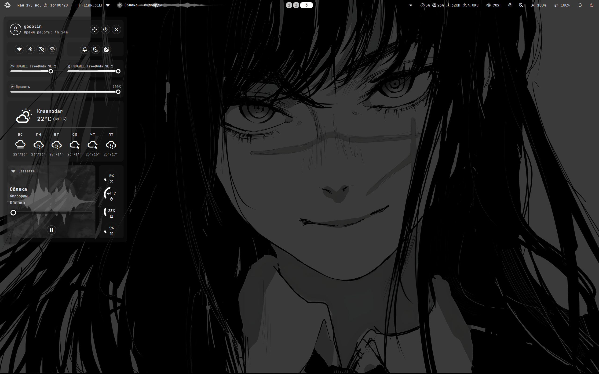

# ❄ nixos-config

Декларативная настройка NixOS — Niri compositor + оболочка Noctalia, полностью воспроизводимая.




---

## Overview

Личный flake-конфиг NixOS для ноутбука `forza` (AMD Ryzen 8000-серия, Radeon 780M, 32 GiB RAM, dual NVMe btrfs). Цель — полная воспроизводимость: одной командой `nixos-rebuild switch --flake .#forza` на чистой системе разворачивается готовый рабочий стол с тайловым композитором Niri, оболочкой Noctalia, ч/б монохромной палитрой и набором повседневных приложений.

Структура построена на `flake-parts` + `import-tree` — каждый модуль это отдельный `.nix` файл под `modules/`, который декларирует свой `flake.nixosModules.<имя>` или `flake.homeModules.<имя>`. Никаких бесконтрольных `imports` через символическую цепочку.

## Stack

| Слой | Что |
|---|---|
| Ядро | `linuxPackages_latest` (свежее, нужно для Radeon 780M и `amd_pstate`) |
| nixpkgs | канал `nixos-unstable` |
| Compositor | [niri](https://github.com/YaLTeR/niri) (stable v25.08, через [niri-flake](https://github.com/sodiboo/niri-flake)) |
| Shell / bar | [noctalia-shell](https://github.com/noctalia-dev/noctalia-shell) на Quickshell |
| Home Manager | master, follows nixpkgs |
| Login manager | greetd + tuigreet |
| Терминал | kitty + fish + starship |
| Файловый менеджер | thunar (GUI), yazi (TUI) |
| Браузер | Yandex Browser (через [miuirussia/yandex-browser.nix](https://github.com/miuirussia/yandex-browser.nix)), brave как fallback |
| Мессенджеры | Telegram Desktop |
| Загрузки | qBittorrent |
| Эмуляторы | Cemu (Wii U) |
| Аудио | pipewire (alsa + pulse + jack) |
| Сеть | NetworkManager + nm-applet |
| Лаунчер | noctalia app launcher (Super+Space), rofi |

## Features

**Графика и тема:**
- Монохромная палитра под чёрно-белые обои: kitty, fish, starship, niri focus-ring, noctalia (`m3-monochrome` generation) и fastfetch — всё в оттенках серого.
- Иконки Papirus-Dark, GTK-тема `adw-gtk3-dark`, курсор `volantes_cursors`.
- Qt-приложения тоже видят системную тему — через `qgnomeplatform-qt6` + `QT_QPA_PLATFORMTHEME=gnome`.

**Energy / гибернация:**
- Крышка / power-button → `suspend-then-hibernate` (через 30 мин из RAM-сна на диск).
- Заряд < 5% → автоматический hibernate (через UPower).
- 36 GiB swap-партиция рассчитана под hibernate из 32 GiB RAM.

**Графика AMD:**
- amdgpu в initrd, RADV (Vulkan), radeonsi (VAAPI/VDPAU).
- 2560×1600 @ 120 Hz, VRR включён.
- USB4 / Thunderbolt: boltd для авторизации hotplug-устройств (eGPU-док, TB4-storage).

**Браузер по умолчанию:**
- Yandex Browser ставится из стороннего флейка `miuirussia/yandex-browser.nix` (распаковка официального .deb + autoPatchelfHook), кэш через `yandex-browser-nix.cachix.org`.
- `xdg.mimeApps` + `$BROWSER` указывают на него — ссылки из Telegram, noctalia, yazi и других приложений открываются в Yandex Browser.
- Раз в неделю user-systemd таймер сравнивает rev из `flake.lock` с master upstream'а и шлёт notify-send, если флейк обновился (rebuild не запускает — решение за пользователем).

**Прочее:**
- Steam с Proton-GE и game-controllers-udev.
- WireGuard через NetworkManager + nm-applet tray-icon.
- Hibernate-aware bootloader: systemd-boot, лимит 5 поколений в меню, GC раз в неделю.
- Терминальные приложения (btop, nvim, yazi, visidata) запускаются из лаунчера через `kitty -e`.

## Keybindings

`Mod` = клавиша Super (Win).

### Окна / навигация

| Биндинг | Действие |
|---|---|
| `Mod+H/J/K/L` или `Mod+←/↓/↑/→` | фокус влево / вниз / вверх / вправо |
| `Mod+Home` / `Mod+End` | первая / последняя колонка |
| `Mod+Ctrl+H/J/K/L` | переместить окно |
| `Mod+Shift+←/↓/↑/→` | изменить размер |
| `Mod+F` | maximize-column |
| `Mod+Shift+F` | fullscreen |
| `Mod+T` | toggle floating |
| `Mod+R` | preset column width |
| `Mod+O` | toggle overview |
| `Mod+C` | закрыть окно |
| `Mod+Shift+M` | завершить niri |

### Рабочие столы

| Биндинг | Действие |
|---|---|
| `Mod+1..9`, `Mod+0` | переключиться на workspace 1..10 |
| `Mod+Shift+1..9`, `Mod+Shift+0` | перенести окно на workspace |

### Приложения

| Биндинг | Действие |
|---|---|
| `Mod+Return` / `Mod+E` | kitty |
| `Mod+B` | Yandex Browser |
| `Mod+Q` | thunar |
| `Mod+V` | rofi-clipboard (cliphist) |
| `Mod+S` / `Mod+Shift+S` | screenshot (область / экран) |

### Noctalia

| Биндинг | Действие |
|---|---|
| `Mod+Space` | app launcher |
| `Mod+Shift+Space` | control center |
| `Mod+Escape` | session menu |
| `Mod+W` | wallpaper selector |
| `Mod+Shift+Comma` | settings |
| `Mod+Shift+B` | toggle bar |
| `Mod+Shift+N` | night light toggle |
| `Mod+Alt+L` / `Mod+Shift+L` | lock screen |

### Медиа и системные

| Биндинг | Действие |
|---|---|
| `Mod+P` / `Mod+Shift+P` | play-pause / stop |
| `Mod+,` / `Mod+.` | previous / next track |
| `Mod+[` / `Mod+]` | seek -10s / +10s |
| `XF86AudioRaise/Lower/Mute` | громкость |
| `XF86MonBrightnessUp/Down` | яркость |

## Structure

```
.
├── flake.nix                  # inputs: nixpkgs / flake-parts / niri / noctalia / home-manager / yandex-browser
├── INSTALL.md                 # подробная инструкция по установке и сопровождению
├── modules/
│   ├── flake-options.nix      # объявление flake.homeModules как mergeable lazy attrset
│   ├── systems.nix            # систем-список для flake-parts
│   ├── hosts/
│   │   └── forza/
│   │       ├── configuration.nix
│   │       ├── default.nix
│   │       └── hardware.nix
│   ├── system/                # NixOS-модули
│   │   ├── audio.nix
│   │   ├── bluetooth.nix
│   │   ├── boot.nix
│   │   ├── cpu.nix
│   │   ├── filesystems.nix
│   │   ├── fonts.nix
│   │   ├── fwupd.nix          # services.fwupd для LVFS-обновлений прошивок
│   │   ├── greetd.nix
│   │   ├── locale.nix
│   │   ├── niri.nix
│   │   ├── nix.nix            # substituters: + yandex-browser-nix.cachix.org
│   │   ├── power.nix
│   │   ├── radeon.nix
│   │   ├── steam.nix
│   │   ├── thunar.nix
│   │   ├── thunderbolt.nix    # boltd + bolt CLI для USB4/TB-устройств (eGPU)
│   │   ├── wireguard.nix
│   │   └── …
│   └── home/                  # Home-Manager модули для пользователя gooblin
│       ├── bash/              # starship + bash
│       ├── fastfetch/         # ASCII-арт при старте fish
│       ├── fish/              # fish-конфиг, алиасы, плагины
│       ├── git.nix
│       ├── gtk/               # GTK-тема и иконки
│       ├── kitty/             # терминал
│       ├── niri/              # ~600 строк config.kdl через programs.niri.settings
│       ├── noctalia/          # ~700 строк settings.json через programs.noctalia-shell.settings
│       ├── obsidian/
│       ├── packages.nix       # GUI/CLI приложения + xdg.mimeApps (default browser)
│       ├── rofi/              # лаунчер и тема
│       ├── tools.nix
│       ├── yandex-update-check/  # weekly systemd-таймер → notify-send при новой версии флейка
│       ├── yazi/
│       └── …
└── Pictures/
    └── previews/
        └── desktop.png        # скриншот для шапки README
```

## Installation

Полная пошаговая инструкция — в [`INSTALL.md`](./INSTALL.md). Кратко:

1. Загрузка с **NixOS minimal ISO**, разметка диска (btrfs RAID0 + ESP + swap).
2. Включить flakes:
   ```bash
   export NIX_CONFIG="experimental-features = nix-command flakes"
   ```
3. Клонировать репо:
   ```bash
   git clone https://github.com/MagisterGudvin/nixosrep /mnt/etc/nixos
   ```
4. Сверить hardware-конфиг через `nixos-generate-config --no-filesystems --root /mnt --dir /tmp/genconf`.
5. Установить:
   ```bash
   sudo nixos-install --flake /mnt/etc/nixos#forza --no-root-password
   sudo nixos-enter --root /mnt -c 'passwd gooblin'
   sudo reboot
   ```
6. На greetd: логин `gooblin`, сессия `niri`.

Дальнейшие обновления:
```bash
cd ~/nixosrep
nix flake update
sudo nixos-rebuild switch --flake .#forza
```
